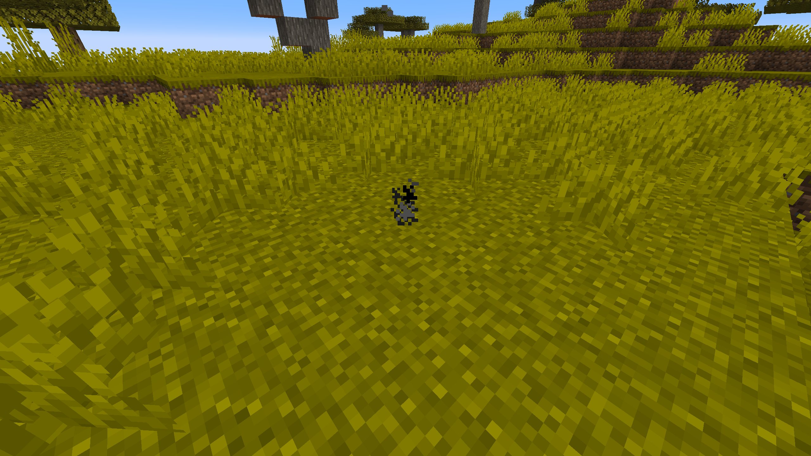
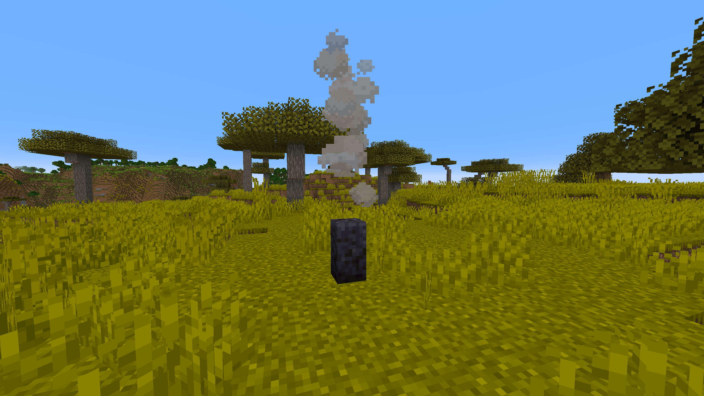

# About
**ParticleGenerator** is a Minecraft mod created mainly for builders and mapmakers. It adds Particle Generator block into the game.

Particle Generator block is highly customisable and using it is much more convenient and efficient than using command blocks. It allows you to generate multiple particles from one block or set generated particles position and speed randomization.


# Usage

### Commands
```
/pgen show - Shows edges of Particle Generators
/pgen hide - Hides edges of Particle Generators
/pgen locate - Adds markers inside Particle Generators
/pgen info - Displays information about mod
/pgen help - Displays the help message with 
```

### Particle Generator block states
```
position=[center(default)/top/bottom] - determines position of particles generation
```

### Particle Generator NBT tags
```
Particles:[{...}] - list of compounds:
  id:"" - particle id
  Motion:[x,y,z] - particle velocities [blocks/tick] (in most cases)
  MotionRand:[x,y,z] - randomization of "Motion" values
  PositionOffset:[x,y,z] - offset of particle positions
  PositionRand:[x,y,z] - randomization of particle positions
  Interval:int - interval between particles [ticks]
  Probability:double - probability of particle spawning
  ParticleCount:int - number of particles when spawned
  ParticleMaxCount:int - maximum number of particles
  AdditionalTags:{} - additional tags (like block id)
UseAnimateTick:bool - spawn particles on animateTick
```
*For position and motion, random value is in range from ```val-(rand/2)``` to ```val+(rand/2)```.

*For particle count, random value is in range from ```ParticleCount``` to ```ParticleMaxCount```.

*By default ```UseAnimateTick``` tag is set to ```false```. That means particles will try to spawn every tick and their spawn rate can be manipulated using ```Interval``` and ```Propability``` tags. When set to ```true``` particles will try to spawn when ```animateTick``` method is called. This will allow you to recreate particles spawn rate of for example torches and many other blocks that uses ```animateTick``` to spawn particles.

*If you want to spawn particles that require additional block or item ID (like for example ```block``` particle) add tag ```AdditionalTags:{id:"some_block_id"}``` .
### Useful Minecraft BlockItem NBT tags
```
BlockStateTag:{} - specifies block states
BlockEntityTag:{} - specifies block NBT tags
```


# Examples

## Simple smoke Particle Generator



**Using a /setblock:** ```/setblock ~ ~ ~ pgen:particle_generator{Particles:[{id:"smoke"}],UseAnimateTick:true}```

**Using a /give:** ```/give @p pgen:particle_generator{BlockEntityTag:{Particles:[{id:"smoke"}],UseAnimateTick:true}}```

## Particle Generator like campfire



**Using a /setblock:** ```/setblock ~ ~ ~ pgen:particle_generator[position=bottom]{Particles:[{id:"campfire_cosy_smoke",Motion:[0.0,0.07,0.0],PositionRand:[0.67,0.0,0.67],ParticleCount:2,ParticleMaxCount:3,Probability:0.11}]}```

**Using a /give:** ```/give @p pgen:particle_generator{BlockStateTag:{position:"bottom"},BlockEntityTag:{Particles:[{id:"campfire_cosy_smoke",Motion:[0.0,0.07,0.0],PositionRand:[0.67,0.0,0.67],ParticleCount:2,ParticleMaxCount:3,Probability:0.11}]}}```

**You can easily get these commands by using ```/pgen help``` and use them as a template.**
